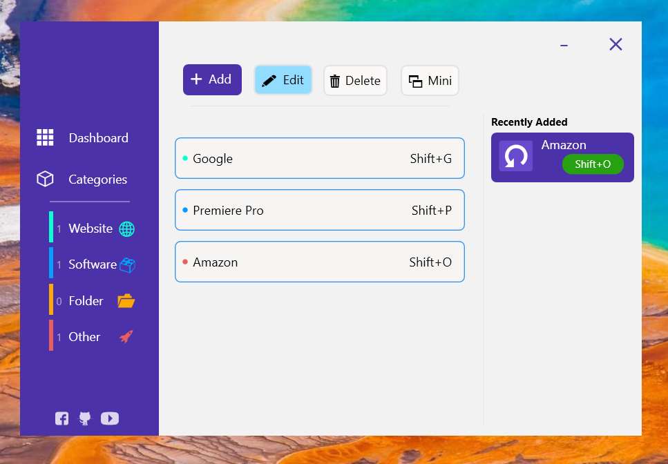
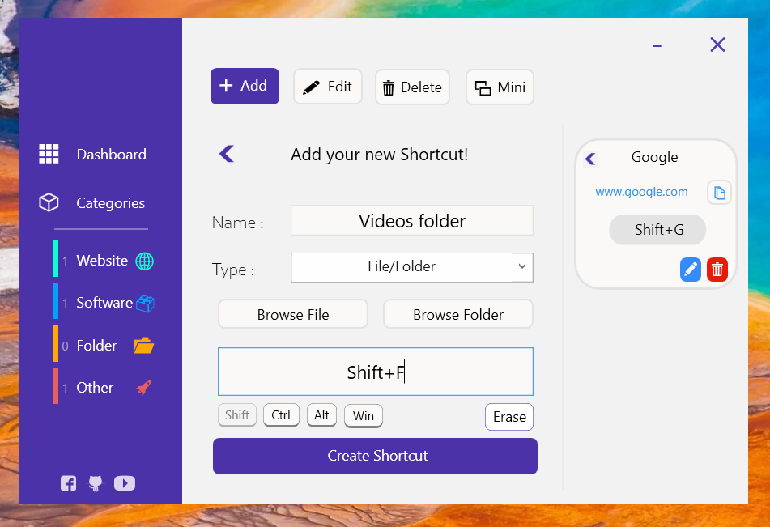
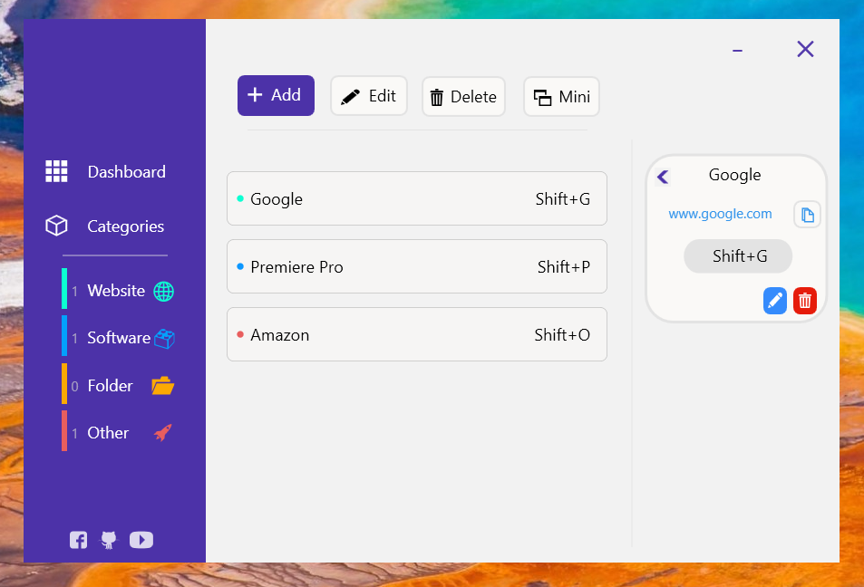

This is another one of my personal project that I hade to make to enhance my workflow, created using C# WPF.

QuickRun is an awesome productivity tool for Windows navigation, allowing the user to create Hotkeys and shotcuts to open Websites, Softwares and Folders in a much faster way.

The idea behind this app is to automate, or atleast make windows navigation faster, enabling me to open multiple softwares or websites on the click of a button, useful especially
for tasks that require high productivity.

For example, I could open youtube.com, Adobe Premiere Pro and my Videos folder in the click of a single button in my keyboard, greatly enhancing my work speed.

Here's a preview of the app, showing some of it's features:

The GUI was one of my top priority in the making of this app, with a pleasant to eyes display, and with very intuitive layout.
All necessary tools and functions like Add, Edit and Delete are completely done in the most simple to use manner, but also containing a thorough exception algorithm
in the backend to rule out any possible errors.

The goal is to create a simple modern design for the front end, and keeping the app as leightweight as possible.

This project was a great way to learn how to interact directly with the Windows OS in the form of registers, and learn how to start software processes programmatically.

As of August 2020, I haven't found any new bugs so I consider the app to be finished and ready to be used.

Thank you. You can contact me at: mohdzish2000@gmail.com
